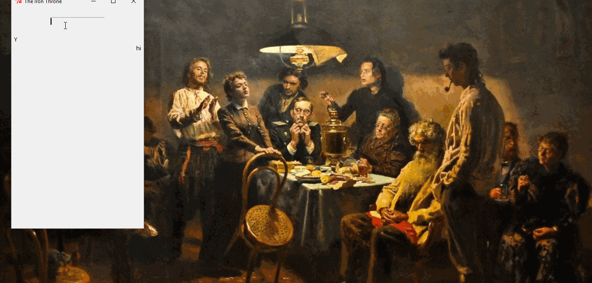

## Bran

#### Here's a list of features of this module
* Used to virtually traverse through your directories from the project.
* Also informs of new files that have been added since last check.
* Allows user to open any directory by folder name.
* Explorer-Traversal Mode - Press :arrow_up: :arrow_down: to scroll in the list.
* Explorer-Traversal Mode - Press :arrow_left: to go to parent directory.
* Explorer-Traversal Mode - Press :arrow_right: to dive into target directory.
* Launch a new survey to find all the new files and folders added since last check
    *in-project rename/ move/ delete/ conflict resolution to be implemeted*

### Under Constant Development
