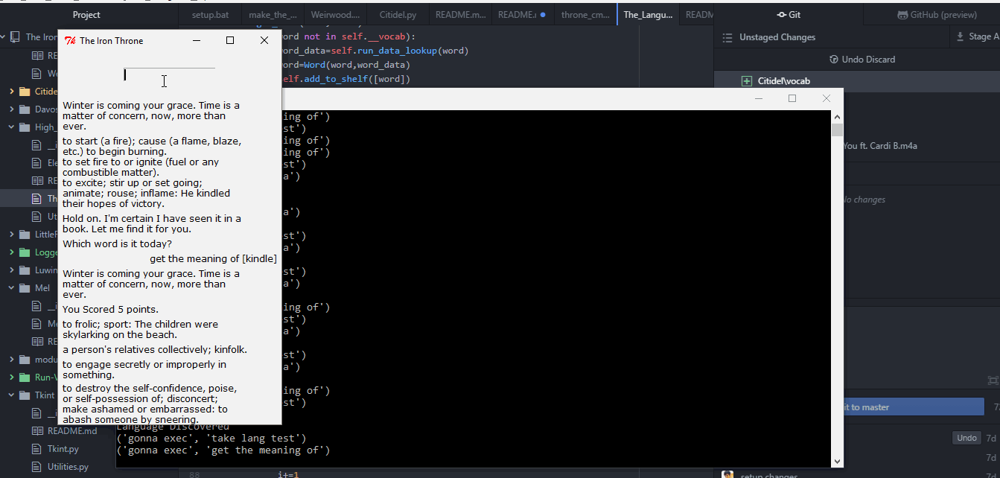

## High_Valyrian

#### Here's a list of features of this module :

* Get the meanings, synonyms and example sentences of words when connected to the internet.
* Does not need to be online when fetching meanings of words that have been found previously.
* Take adaptive tests for your vocabulary on words found using this module.
* Clean data on every module start to remove incorrect/ corrupted words..
* ###### Functions written here are used in main thread.

#### Under Constant Development
