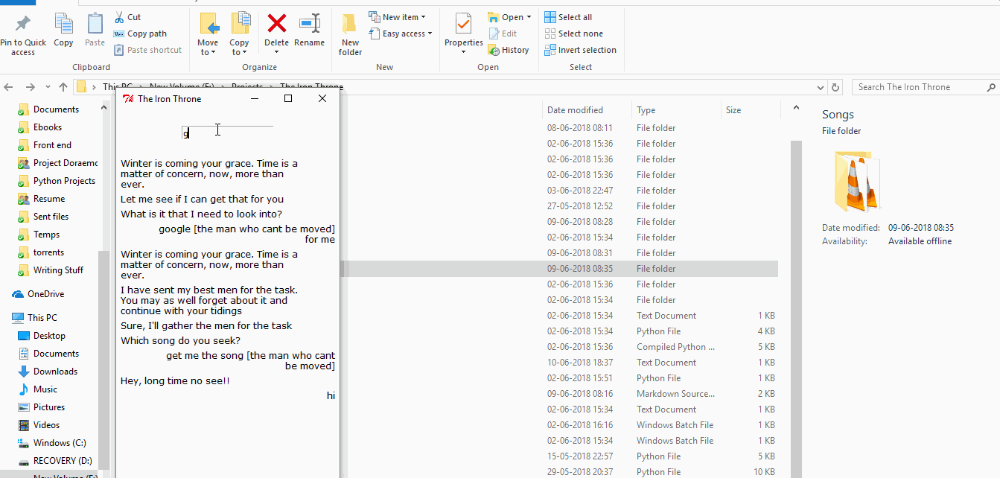

# Under Construction

## Mel

#### Here's a list of everything this one can do :

* get youtube best search result link for a query
* download audio from url
* simulate Alt+Tab required number of times
* open any search query in duckduckgo or google
* calculate any mathematical expression in clipboard

###### Functions written here are used in main thread.

