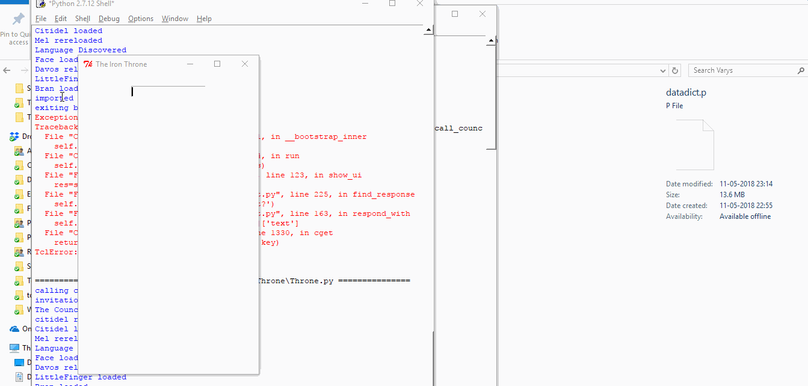

## Tkint

#### Here's a list of features of this module :

* Basic 'not-hidden' UI of the project
* Easy chatbot for basic tasks (Not ideal for as a chatting bot. Mainly for some interaction and task execution.)
* Uses Citidel for Data
* Send Inputs by pressing '<' in the Input box.
* Text shows up with minimal formatting.
* Uses dictionaries stored as JSON to reply during conversations.
* Character mimic is pending. Tyrion Lannister is the only character for now.
* Chatbot data-set is less but grows exponentially with use and manual feedback.
* Able to learn from chats. Requires manual entry of data in citidel 'deep conversations json' for very growth of Chatbot.
* Takes in-line command data in '[]'. To open the data 'friends' as the folder name to open, I can pass 'open the folder [friends]' as the command.
* Utilities file contains independent functions
* ###### Only an interface that allows the user to execute commands from other modules. Has no specific power other than being a chatbot interface.
* ###### Functions written here are used in main thread.

### Under Constant Development
